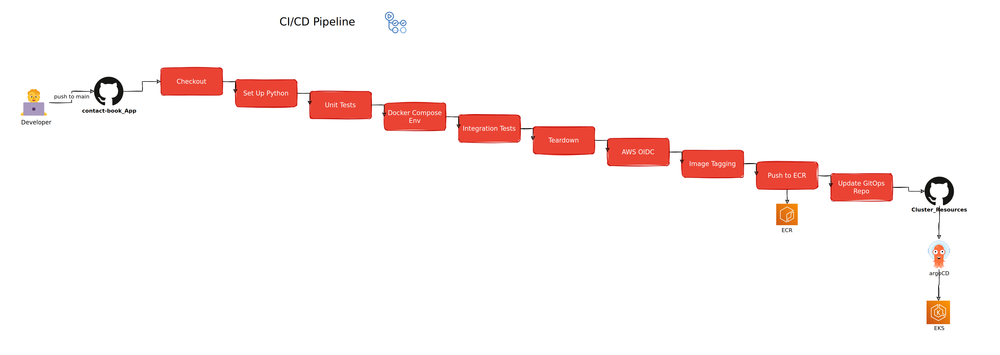

# Contact Book Application

A small Flask service that stores contacts in MongoDB and exposes them through a REST API and a
single-page HTML UI. This repository also contains the container build, the local Docker Compose
stack, the tests, and the CI/CD pipeline.

## Overview

The application manages a list of people (name, phone, email). It supports create, read, update,
delete, and a simple field search. If MongoDB is unreachable the site still loads and the API
returns `503` for data operations rather than failing hard.

## Application Architecture

A single Flask module defines the routes and the MongoDB connection. On startup it reads the
connection string, opens a client with a short server-selection timeout, and ensures a unique index
on the contact identifier. Each contact gets a generated UUID that is used as its public id. The
`/health` route reports whether the web process is up and whether MongoDB currently answers a ping.

## API Reference

| Endpoint | Method | Description |
|---|---|---|
| `/` | GET | HTML user interface |
| `/health` | GET | Web and database status |
| `/person` | GET | List all contacts, or search with `?field=&value=` (`field` = id, name, phone, or email) |
| `/person` | POST | Create a contact (`name` required) |
| `/person/{id}` | GET | Fetch one contact |
| `/person/{id}` | PUT | Update a contact |
| `/person/{id}` | DELETE | Delete a contact |

## Configuration

| Variable | Description |
|---|---|
| `MONGO_URI` | MongoDB connection string; data operations are disabled if unset |
| `MONGO_DB` | database name (defaults to `contact_book`) |

`.env.example` shows the variables the local stack expects. Real values go in an untracked `.env`.

## MongoDB Integration

The application talks to MongoDB through PyMongo using a single connection string. Locally it
connects to the `mongo` container as the root user; in the cluster it connects to the MongoDB
replica set as an application user, with the connection string supplied by a Kubernetes secret that
External Secrets Operator renders.

## Docker

The image is built in two stages from `python:3.12-slim`: the first stage installs the Python
dependencies, the second copies only those packages plus the application code. It runs as a
non-root user and exposes port 5000.

## Docker Compose

`docker-compose.yaml` brings up the full local stack:

- **nginx** (`1.28.0-alpine`) - reverse proxy on port 80 with gzip and basic security headers
- **app** - the Flask container, reached only through nginx
- **mongodb** (`8.0`) - database with a named volume for persistence

The app container has a health check on `/health`, and nginx waits for it to become healthy.

## Local Development

```bash
docker compose up --build
# app:        http://localhost
# health:     http://localhost/health
```

Set `DB_USER`, `DB_PASSWORD`, and `DB_NAME` in a `.env` file first.

## Tests

- **Unit tests** (`tests/unit_test.py`) - run with `pytest`; MongoDB is mocked, so no database is
  needed. They cover every route including the database-unavailable path.
- **Integration tests** (`tests/integration_test.py`) - real HTTP requests against the running
  Compose stack through nginx. They wait for `/health`, then create, read, search, and delete a
  contact against a real MongoDB.

## CI/CD Pipeline



The pipeline is a single GitHub Actions workflow. It tests the change, builds and publishes the
image, and updates the GitOps repository. Argo CD does the actual deployment.

### Workflow Triggers

The workflow runs only on a push to the `main` branch.

### Pipeline Stages

#### Test

```text
- Check out the repository
- Set up Python 3.12 and install dependencies
- Run the unit tests
- Start the integration environment with Docker Compose
- Run the integration tests
- Tear the environment down
```

#### Build & Publish

```text
- Assume an AWS role through GitHub OIDC
- Log in to Amazon ECR
- Tag the built image with the release version
- Push the image to ECR
```

#### GitOps Update

```text
- Clone the Cluster Resources repository
- Rewrite the image tag in the contact-book Deployment
- Commit and push the change
```

### Image Lifecycle

The version is `1.0.<workflow run number>`, so the patch number increases automatically with each
run. Only the versioned tag is published; there is no `latest` tag and no digest pinning.

### ECR Publication

The image is pushed to a private Amazon ECR repository. AWS access uses a short-lived role assumed
through GitHub OIDC, so no long-lived AWS keys are stored in the repository.

### GitOps Repository Update

The workflow clones the Cluster Resources repository using a personal access token
(`GITOPS_PAT`), replaces the image tag in `applications/contact-book/deployment.yaml`, and commits
the change as `github-actions[bot]`.

### Argo CD Deployment

Argo CD, running in the cluster, notices the new commit and syncs it. The Deployment performs a
rolling update to the new image. Rolling back means reverting that commit.

### Required Setup

- `GITOPS_PAT` repository secret with write access to the Cluster Resources repository.
- An AWS IAM role trusted for GitHub OIDC from this repository.
- A private ECR repository for the image.

## Limitations

- The container runs Flask's built-in development server rather than a production WSGI server.
- API endpoints have no authentication or authorization.
- The search value is passed straight into a MongoDB regular expression.
- `prometheus-client` is listed as a dependency but the application exposes no metrics endpoint.
- CI does not run linting, dependency auditing, or image vulnerability scanning.
