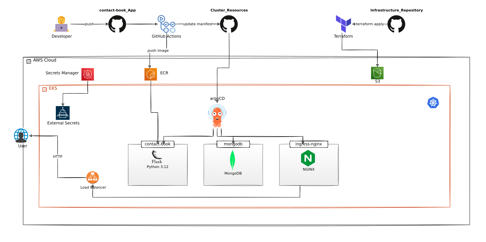

# Contact Book — DevOps Portfolio

An end-to-end DevOps project built around a small Flask "Contact Book" REST API. The application is
intentionally simple; the focus of the project is everything around it — container build, a
GitHub Actions pipeline, Terraform-provisioned AWS infrastructure, GitOps delivery with Argo CD, and
credential management with External Secrets Operator.

## Project Overview

The project is split across three independent repositories that work together:

1. **Application** (`DevOps-Portfolio-contact-book_App`) — the Flask API, its Dockerfile, a local
   Docker Compose stack, the test suite, and the GitHub Actions CI/CD workflow.
2. **Infrastructure** (`DevOps-Portfolio-Infrastructure`) — Terraform that provisions an AWS VPC and
   an EKS cluster, and bootstraps Argo CD and External Secrets Operator into it.
3. **Cluster Resources** (`DevOps-Portfolio-Cluster_Resources`) — the GitOps repository Argo CD
   watches: an App-of-Apps root plus the contact-book workload, MongoDB, and the ingress controller.

## Project Goals

- Demonstrate a complete path from a code change to a running workload on Kubernetes.
- Keep application, infrastructure, and cluster state in separate repositories with clear ownership.
- Use pull-based GitOps rather than pushing deployments from CI.
- Generate and distribute database credentials without ever committing them.

## High-Level Architecture



A developer pushes to the application repository. GitHub Actions runs the tests, builds the image,
authenticates to AWS with OIDC, pushes to Amazon ECR, and updates the image tag in the Cluster
Resources repository. Argo CD — running in EKS and installed by Terraform — detects the change and
syncs it to the cluster. Incoming traffic reaches the application through the ingress-nginx
controller and an AWS load balancer; the application talks to a MongoDB replica set. Database
credentials are generated in-cluster by External Secrets Operator and mirrored to AWS Secrets
Manager.

## Technology Stack

### Application Layer
- **Python 3.12 / Flask** - REST API and server-rendered UI
- **PyMongo** - MongoDB driver
- **MongoDB** - contact storage (replica set in the cluster, single container locally)
- **Nginx** - reverse proxy for the local Docker Compose stack

### Containerization & Orchestration
- **Docker** - multi-stage image build, non-root runtime
- **Docker Compose** - local stack and the CI integration environment
- **Kubernetes / Amazon EKS** - managed cluster that runs the workloads
- **Helm** - MongoDB and ingress-nginx are installed from community charts

### CI/CD & GitOps
- **GitHub Actions** - test, build, publish, and GitOps update
- **Amazon ECR** - private container registry
- **Argo CD** - GitOps controller using the App-of-Apps pattern

### Infrastructure as Code
- **Terraform** - all AWS and in-cluster bootstrap resources
- **Amazon S3** - remote Terraform state with native state locking
- **AWS VPC** - cluster networking
- **IAM / IRSA** - scoped identities for GitHub Actions and in-cluster controllers

### Secrets & Security
- **External Secrets Operator** - generates and syncs database credentials
- **AWS Secrets Manager** - system of record for secrets
- **GitHub OIDC** - keyless authentication from CI to AWS

### Networking
- **ingress-nginx** - in-cluster ingress controller
- **AWS Load Balancer** - external entry point
- **Amazon EBS (gp3)** - persistent volumes for MongoDB

## Repository Architecture

```
DevOps-Portfolio-contact-book_App/     Application + CI/CD
├── app.py                             Flask API and UI
├── Dockerfile                         multi-stage build
├── docker-compose.yaml                local stack (nginx + app + mongo)
├── tests/                             unit + integration tests
└── .github/workflows/ci-cd.yml        the pipeline

DevOps-Portfolio-Infrastructure/       Terraform (AWS + bootstrap)
├── main.tf                            network, EKS, add-ons, IAM, Argo CD
├── backend.tf                         S3 remote state
└── modules/                           network, storage class, argo_cd

DevOps-Portfolio-Cluster_Resources/    GitOps desired state
└── applications/                      App-of-Apps root + contact-book / mongodb / ingress-nginx
```

The application repository writes to the Cluster Resources repository from CI. The Infrastructure
repository provisions the cluster and points Argo CD at the Cluster Resources repository. Argo CD
then reconciles Cluster Resources into the cluster.

## Infrastructure Summary

Terraform provisions a VPC and an EKS cluster with a managed node group, adds the core EKS add-ons
and a default gp3 storage class, and then installs Argo CD and External Secrets Operator. Remote
state is stored in S3. See **[Infrastructure-README.md](Infrastructure-README.md)**.

## Kubernetes / GitOps Summary

Argo CD runs an App-of-Apps: a root `Application` points at the Cluster Resources repository, which
in turn defines three child applications — the contact-book workload, MongoDB (Bitnami chart), and
ingress-nginx. All applications sync automatically with prune and self-heal enabled. See
**[Cluster-Resources-README.md](Cluster-Resources-README.md)**.

## CI/CD Summary

On every push to `main`, GitHub Actions runs unit and integration tests, builds and pushes the image
to ECR, and commits the new image tag to the Cluster Resources repository. Argo CD picks up the
commit and performs a rolling update. See **[Application-README.md](Application-README.md)**.

## Secrets Management Summary

External Secrets Operator generates the MongoDB credentials inside the cluster, hands them to the
MongoDB chart, and pushes them to AWS Secrets Manager. A separate `ExternalSecret` reads them back
and injects the connection details into the application. No database password is stored in Git.

## Deployment Model

Deployment is **pull-based**. CI never runs `kubectl` or `helm`. The only thing CI does to deploy is
commit a new image tag to Git; Argo CD is responsible for applying it. Rolling back means reverting
that commit.

## Repository Navigation

| Repository | Contains | Detailed README |
|---|---|---|
| `DevOps-Portfolio-contact-book_App` | Flask app, Dockerfile, Compose stack, tests, CI/CD | [Application-README.md](Application-README.md) |
| `DevOps-Portfolio-Infrastructure` | Terraform for VPC, EKS, Argo CD and ESO bootstrap | [Infrastructure-README.md](Infrastructure-README.md) |
| `DevOps-Portfolio-Cluster_Resources` | Argo CD applications and Kubernetes manifests | [Cluster-Resources-README.md](Cluster-Resources-README.md) |

## Getting Started / Deployment Orientation

1. **Provision the cluster.** Set the Terraform variables and run `terraform apply` in the
   Infrastructure repository. This creates the VPC and EKS cluster and installs Argo CD and
   External Secrets Operator.
2. **Let GitOps take over.** Argo CD syncs the Cluster Resources repository and brings up
   ingress-nginx, MongoDB, and the contact-book workload.
3. **Ship the application.** Push to `main` in the Application repository. GitHub Actions tests,
   builds, publishes to ECR, and updates the image tag in Cluster Resources; Argo CD rolls it out.
4. **Run it locally.** `docker compose up --build` in the Application repository starts nginx, the
   app, and MongoDB on `http://localhost`.

## Important Limitations

- The EKS API endpoint is publicly reachable — a training convenience, not a production posture.
- Cluster networking uses public subnets only; there are no private subnets or NAT.
- The application is served over plain HTTP and has no authentication on its endpoints.
- No metrics, dashboards, or log aggregation are deployed.
- Workload manifests do not define health probes or resource requests/limits.
- Parts of the infrastructure runbook (Kubernetes version, node count) predate the current Terraform.

## Documentation Map

- [Application-README.md](Application-README.md) — the Flask service, Docker, tests, and the pipeline
- [Infrastructure-README.md](Infrastructure-README.md) — Terraform, AWS, and the cluster bootstrap
- [Cluster-Resources-README.md](Cluster-Resources-README.md) — Argo CD, GitOps, and the workloads
- `system-architecture.drawio` / `cicd-gitops.drawio` — editable diagram sources

## Learning Outcomes

- Splitting a system into application, infrastructure, and GitOps repositories.
- Building a GitHub Actions pipeline that ends in a Git commit rather than a deploy command.
- Provisioning EKS and its bootstrap tooling with Terraform.
- Running Argo CD with the App-of-Apps pattern.
- Managing generated secrets with External Secrets Operator and AWS Secrets Manager.
# DevOps-Portfolio
